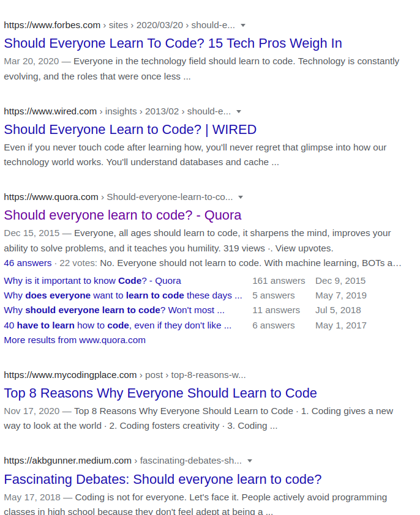
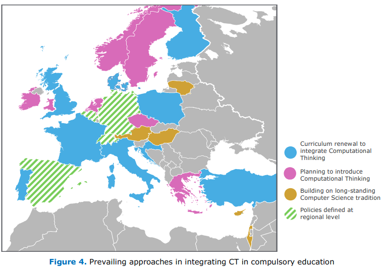
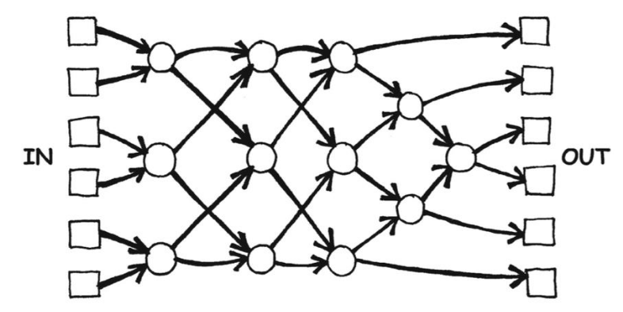
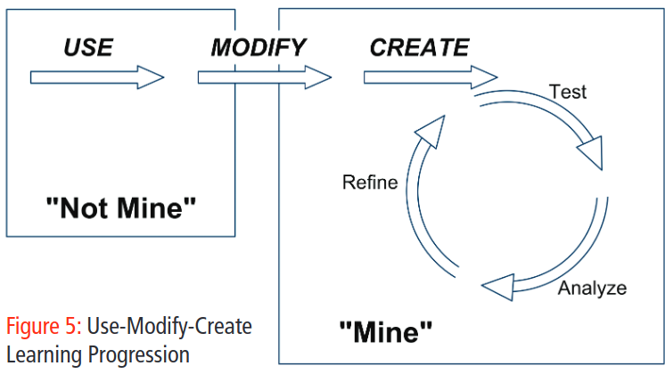
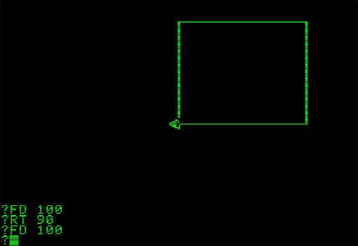
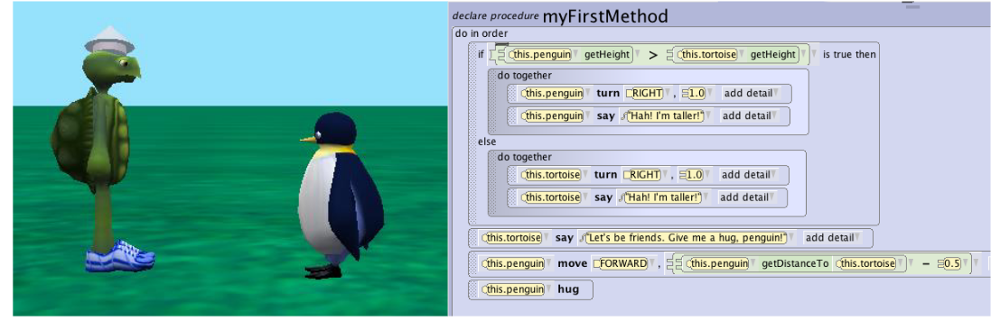
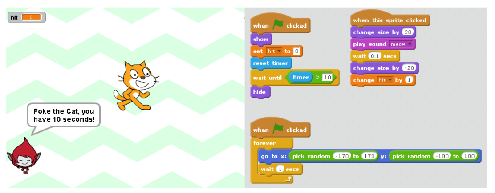

# ¿Deberíamos todos aprender a programar?

## Pensamiento Computacional

### Qué es

Es un proceso o habilidad de pensamiento que utiliza enfoques analíticos o algorítmicos para formular, analizar y resolver problemas[^1]. La característica distintiva es su enfoque en los procesos y métodos de resolución de problemas y en la creación de soluciones computacionales[^7]. Tiene pensamientos de algoritmos, ingeniería, diseño y matemática.

Se compone de[^1]:

* Abstracción: hacer algo más comprensible a través de su simplificación

* Algoritmia: pensar una forma de llegar a una solución mediante una serie de pasos claros.

* Descomposición: desarmar algo en componentes que puedan ser estudiados independientemente.

* Debuggear: aplicación sistemática (a veces) de análisis y evaluación para predecir y verificar resultados.

* Generalización: identificar patrones, similitudes y conexión.

Programar no es sólo escribir código, es decir, sintaxis. Entre programadores es clásico el debate de si HTML es un lenguaje de programación o no, siendo un lenguaje de _markup_, de decir, de presentación.

### Para qué sirve

El Pensamiento Computacional puede permitirle a los jóvenes pensar en una forma diferente a la hora de resolver problemas, analizar situaciones de la vida cotidiana desde una perspectiva diferente, desarrollar la capacidad de descubrir, crear e innovar, encontrar patrones de datos, cuestionar evidencia, descomponer problemas, razonar sobre abstracciones, o entender qué tiene para ofrecer la tecnología. Las habilidades que enseñan atraviesan los dominios de una disciplina y hasta permite expresarse con medios digitales.[^1]

    “Las ideas computacionales son una forma de expresarse y entender el mundo.”
    Mitchel  Resnick

[^1]

### Por qué incluirla en la currícula

El motivo principal para la mayoría de los países es para fomentar el desarrollo de las habilidades necesarias para la economía futura del mundo digital[^1][^7]. También, de paso, provee beneficios como habilidad intelectual[^1].

### ¿Cómo enseñar?

No es razonable pensar en incorporar estos conceptos sin soporte. Y el soporte debería ser continuo, por ejemplo Google ofrece Computational Thinking for Educators[^8].

A pesar de este interés generalizado, la integración exitosa de Pensamiento Computacional en la educación obligatoria aún enfrenta problemas y desafíos sin resolver[^1][^7]. La introducción de Pensamiento Computacional en la currícula escolar en todos los niveles crea una demanda de gran escala de desarrollo profesional continuo para les docentes[^1][^2][^4][^8].

Es crucial darle al alumnado la posibilidad de trabajar en áreas que les interesen[^1].

El momento óptimo para incorporarlo es durante la adolescencia temprana[^1][^4][^5]. 

Una forma de hacerlo es sin la computadora, aprendiendo algoritmos con juegos[^1][^7].

[^1]

Alternativamente existe el paradigma usar-modificar-crear

Al moverse por esta progresión hay que tener cuidado de no ir demasiado rápido, para no causar ansiedad, ni demasiado lento, para no producir aburrimiento.[^2]

Por otro lado existen los cursos online masivos (MOOC) que permiten llegar a más personas, pero tienen altas tasas de abandono[^1][^7].

Una forma popular de introducir cursos de programación en todos los niveles educacionales es a través de desafíos en el desarrollo de juegos. Son atractivos, orientados a metas e interactivo produciendo un aprendizaje divertido y pedagógico[^7].

### Para quiénes

El pensamiento computacional no está en sí sesgado hacia un grupo aunque la forma de enseñarlo puede estarlo. Por ejemplo si se hace a través de videojuegos puede fomentar la educación más hacia varones, mientras que si la temática es sobre historias creativas el público beneficiado sea más feminizado[^1][^3]. También hay que considerar que estas últimas pueden resultar en programas más sencillos siendo contraproducente[^3].

### Cómo aprender

Usar herramientas visuales, por sobre texto plano, puede ser más eficiente, motivar más a les estudiantes reduciendo el peso de tener que cargar con la sintaxis de un lenguaje.[^6]

#### [Logo](https://en.wikipedia.org/wiki/Logo_(programming_language))

)

#### [Alice](https://www.alice.org/)

#### [Pocket Code](https://share.catrob.at/app/)

#### [Scratch](https://scratch.mit.edu/)

### Ejemplos

Usando scratch, en quinto grado, en Italia, les chiques reportaron que fue una experiencia positiva. Practicaron primero individualmente y después en grupo, en el segundo caso dijeron que tuvieron problemas al trabajar en equipo pero que el resultado terminó siendo mejor.[^5]

En Estados Unidos, también en quinto grado y usando scratch, se encontró que no hubo una mejora significativa en la habilidad de solucionar problemas ni en la confianza al hacerlo, pero también declararon la experiencia positiva y los incentivaba a seguir aprendiendo.[^5]

## Conclusión

¿Deberíamos todes aprender a programar?
Probablemente no sea necesario que todes aprndamos a codear. Pero programar parece ser la mejor forma de aprender pensamiento computacional, lo que incluye abstraer, generalizar, descomponer, que son herramientas útiles en la solución de problemas. Hay alternativas amigables para hacerlo. Las personas expuestas a programación en etapas tempranas reportan que es una experiencia positiva, y las incentiva a seguir aprendiendo.

Sin embargo, cómo lograrlo es un desafío. La industria informática tiene un exceso de demanda que choca contra los magros salarios educativos. Les docentes actuales, en general, no recibieron este tipo de educación, e incorporarlo no parece trivial.

[^1]: Bocconi, S., Chioccariello, A., Dettori, G., Ferrari, A., & Engelhardt, K. (2016). Developing Computational Thinking in Compulsory Education (EUR 28295 EN). European Commission, Joint Research Centre. [https://publications.jrc.ec.europa.eu/repository/bitstream/JRC104188/jrc104188_computhinkreport.pdf](https://publications.jrc.ec.europa.eu/repository/bitstream/JRC104188/jrc104188_computhinkreport.pdf)
[^2]: Lee, I., Martin, F., Denner, J., Coulter, B., Allan, W., Erickson, J., Malyn-Smith, J., & Werner, L. (2011). Computational thinking for youth in practice. ACM Inroads, 2(1), 32–37. [https://doi.org/10.1145/1929887.1929902](https://arxiv.org/abs/1908.06637)
[^3]: Spieler, B., Grandl, M., Ebner, M. & Slany, W. (2019). "Computer Science for all": Concepts to engage teenagers and non-CS students in technology. Retrieve January 17, 2021, from the arXiv database. [https://arxiv.org/abs/1908.06637](https://arxiv.org/abs/1908.06637)
[^4]: KALELIOĞLU, F., & GÜLBAHAR, Y. (2014). The Effects of Teaching Programming via Scratch on Problem Solving Skills: A Discussion from Learners’ Perspective. Informatics in Education, 13(1), 33–49. [https://files.eric.ed.gov/fulltext/EJ1064285.pdf](https://files.eric.ed.gov/fulltext/EJ1064285.pdf)
[^5]: Benvenuti, M., Chioccariello, A., & Giammoro, G. (2019). Programming to learn in Italian primary school. Proceedings of the 14th Workshop in Primary and Secondary Computing Education. [https://doi.org/10.1145/3361721.3361732](https://doi.org/10.1145/3361721.3361732)
[^6]: Kaucic, Branko & Asic, Teja. (2011). Improving introductory programming with Scratch?. 1095-1100. [https://www.researchgate.net/publication/221412968_Improving_introductory_programming_with_Scratch](https://www.researchgate.net/publication/221412968_Improving_introductory_programming_with_Scratch)
[^7]: Graßl, I., Geldreich, K., & Fraser, G. (2021). Data-driven Analysis of Gender Differences and Similarities in Scratch Programs. The 16th Workshop in Primary and Secondary Computing Education. [https://doi.org/10.1145/3481312.3481345](https://doi.org/10.1145/3481312.3481345)
[^8]: Yadav, A., Hong, H., & Stephenson, C. (2016). Computational Thinking for All: Pedagogical Approaches to Embedding 21st Century Problem Solving in K-12 Classrooms. TechTrends, 60(6), 565–568. [https://doi.org/10.1007/s11528-016-0087-7](https://doi.org/10.1007/s11528-016-0087-7)
